# Schema Decisions: GEM India Conference App
**Generated:** 2026-04-07
**Source:** .planning/data-requirements.md (data grilling session)
**Tables:** 18
**Total indexes:** 95+
**Foreign keys:** 38 (all indexed)

---

## Design Philosophy

- **Normalized to 3NF.** No denormalization without proven query performance need.
- **Future-proofed for:** multi-tenancy (organization_id), institutional sales, public API (UUIDs), compliance (soft deletes + anonymization).
- **Soft deletes** on all user-facing and operational data. No hard deletes in normal operations.
- **Audit** via Bemi (automatic PG-level CDC) + created_by/updated_by on every table.
- **UUID primary keys** (defaultRandom / UUIDv4) — IDs exposed in URLs, QR codes, and future API. UUIDv7 preferred at migration time if available.
- **TEXT over VARCHAR(n)** everywhere — same performance, no arbitrary limits.
- **TIMESTAMPTZ** everywhere — stored UTC, displayed via event.timezone (Asia/Kolkata default).
- **TEXT + CHECK** for evolving enums (statuses, types) — can add values without migration. PostgreSQL ENUM used nowhere.
- **JSONB** for semi-structured config blocks (branding, module toggles, field config, preferences). Core relationships in proper tables.
- **Event-scoped queries** on every operational table. Every event-scoped table has an event_id FK + index.

---

## Table Inventory

| # | Table | Domain | Purpose |
|---|-------|--------|---------|
| 1 | organizations | Multi-tenancy | Future org boundary. V1: single row. |
| 2 | events | Events | Primary data boundary |
| 3 | halls | Events | Physical spaces within venue |
| 4 | event_user_assignments | Events | Per-event access control (Clerk user → event) |
| 5 | people | People | Master identity database |
| 6 | sessions | Program | Scheduled time blocks |
| 7 | session_role_requirements | Program | Planning: "needs 1 Chair, 3 Speakers" |
| 8 | session_assignments | Program | Confirmed person → session → role |
| 9 | faculty_invites | Program | Invitation/confirmation workflow |
| 10 | program_versions | Program | Published schedule snapshots |
| 11 | event_registrations | Registration | Person → event participation |
| 12 | travel_records | Logistics | Journey segments |
| 13 | accommodation_records | Logistics | Hotel bookings |
| 14 | transport_batches | Logistics | Operational movement groups |
| 15 | vehicle_assignments | Logistics | Vehicles in batches |
| 16 | transport_passenger_assignments | Logistics | Person → vehicle → batch |
| 17 | certificate_templates | Certificates | pdfme design blueprints |
| 18 | issued_certificates | Certificates | Immutable issuance records |
| 19 | notification_templates | Communications | Governed sendable assets |
| 20 | notification_log | Communications | Proof-of-send records |
| 21 | notification_delivery_events | Communications | Raw provider webhook payloads |
| 22 | automation_triggers | Communications | Business event → notification bindings |
| 23 | red_flags | System | Cascade change alerts |
| 24 | attendance_records | Attendance | Physical presence / QR check-in |

---

## Key Design Decisions

### 1. UUID Primary Keys (Not BIGINT)

**Decision:** UUID (defaultRandom) for all tables.
**Why:** IDs appear in URLs, QR codes, verification links, and future public API. BIGINT would expose sequential information and require mapping layers. UUID avoids that entirely.
**Trade-off:** Slightly larger index size. Acceptable for this scale (20K registrations max per event, not millions).
**Future:** Migrate to UUIDv7 (time-ordered) when Drizzle supports it natively to reduce index fragmentation.

### 2. Clerk User ID as TEXT (Not FK to a users table)

**Decision:** Store `clerk_user_id` as TEXT in `created_by`, `updated_by`, `reviewed_by`, etc.
**Why:** Users are Clerk-managed. We don't own a users table. Clerk IDs are opaque strings. Creating a shadow users table would add sync complexity with no benefit. For background jobs, store system actors like `system:inngest`.
**Trade-off:** No referential integrity on actor fields. Acceptable because Clerk is the source of truth.

### 3. TEXT + CHECK for Enums (Not PostgreSQL ENUM)

**Decision:** All status/type fields use TEXT with application-level validation (Zod schemas).
**Why:** PostgreSQL ENUM types cannot have values removed without recreation. Event statuses, registration categories, and session types will evolve. TEXT + Zod validation gives the same safety with easier migration.
**Note:** CHECK constraints can be added in migration SQL for defense-in-depth.

### 4. JSONB for Configuration Blocks

**Decision:** Module toggles, field config, branding, registration settings, preferences stored as JSONB.
**Why:** These are semi-structured, change shape per-event, and are always read/written as a unit. Normalizing them into separate tables would create dozens of tiny tables with no query benefit.
**GIN indexes** added on tags (people) for containment queries.

### 5. Separate Halls Table (Not inline text)

**Decision:** `halls` as its own table with unique (event_id, name).
**Why:** Prevents "Hall A" vs "Hall-A" typo duplicates. Enables clean grouping in schedule grid and attendance analytics. Capacity tracking per hall.

### 6. Session Hierarchy: One Level Only

**Decision:** `parent_session_id` self-FK on sessions. Child's parent must have null parent.
**Why:** Covers all real-world medical conference formats (symposium → talks). No three-level nesting exists in practice. Enforced at application level (DB CHECK constraint recommended).

### 7. Session Assignments Separate from Role Requirements

**Decision:** Two tables: `session_role_requirements` (planning demand) and `session_assignments` (confirmed people).
**Why:** Requirements define "need 1 Chair, 3 Speakers" without person_id. Assignments have non-null person_id always. No TBA placeholder rows. UI shows "Speakers 2/3" by joining both tables.

### 8. Faculty Invites as Separate Table

**Decision:** `faculty_invites` tracks invitation/confirmation workflow independently of `session_assignments`.
**Why:** Keeps assignment table clean of workflow state. V1 invites cover the whole responsibility bundle per person per event. Assignments are scheduling truth; invites are confirmation workflow.

### 9. Registration: No Payment, No Tickets

**Decision:** `event_registrations` uses category (delegate/faculty/invited_guest/sponsor/volunteer), not ticket types.
**Why:** Indian medical academic conferences handle payments offline. The owner's spec has no payment/ticketing requirements. Category is a participation classification.

### 10. Travel/Accommodation Without Required Registration

**Decision:** `registration_id` is nullable on travel and accommodation records.
**Why:** Faculty may need logistics without delegate registration. VIP guests and chairpersons get travel/hotel arranged through program workflow, not registration. Forcing registration_id would create fake registrations.

### 11. Three-Tier Transport Model

**Decision:** `transport_batches` → `vehicle_assignments` → `transport_passenger_assignments`.
**Why:** Batches group by hub (BOM T2, not just "Mumbai"). Vehicles attach to batches. Passengers assign to vehicles. Each tier has independent status lifecycle. This is the minimum model that works during live event chaos.

### 12. Hub-Level Transport Grouping

**Decision:** `pickup_hub` and `drop_hub` with `*_hub_type` (airport/railway_station/hotel/venue/other).
**Why:** BOM T2 and Mumbai Central are different transport problems. City-level grouping would make the ops board useless.

### 13. Certificate Supersession Chain

**Decision:** `superseded_by_id` and `supersedes_id` on issued_certificates. Regeneration creates new row.
**Why:** Certificates are legal documents. Overwriting is unacceptable. Supersession chain preserves history. Only one `issued` certificate per (person, event, type) at a time.

### 14. Signed URLs for Certificate Files

**Decision:** Store `storage_key` (R2 path), not public URL. Generate signed URLs on demand.
**Why:** Certificates contain PII. Permanent public URLs are a privacy risk. Signed URLs expire and are access-controlled.

### 15. Notification Log: Split Recipient Fields

**Decision:** `recipient_email` and `recipient_phone_e164` as separate fields, not one `recipient_address`.
**Why:** Enables efficient querying ("find all WhatsApp messages to this phone number"). Avoids type-guessing on a polymorphic field.

### 16. Notification Delivery Events: Separate Table

**Decision:** Raw provider webhook payloads in `notification_delivery_events`, not in notification_log.
**Why:** Keeps the main log operational and readable. Webhook payloads can be verbose and vendor-specific. Forensic tracing needs them; daily operations don't.

### 17. One Trigger = One Channel

**Decision:** `automation_triggers` has singular `channel` (email OR whatsapp), not an array.
**Why:** Email and WhatsApp may need different timing, conditions, or templates. Two rows for both channels gives independent configurability. A `channels[]` array looks compact but couples unrelated concerns.

### 18. Red Flag Uniqueness

**Decision:** Unique constraint on (event_id, target_entity_type, target_entity_id, flag_type) WHERE flag_status != 'resolved'.
**Why:** Prevents spam from repeated travel edits. Only one active flag per target + type. Resolved flags don't block new ones.

### 19. Attendance Separate from Registration

**Decision:** `attendance_records` table, not a status on registration.
**Why:** Attendance is repeatable (Day 1, Day 2), per-session, and reversible. Registration is approval/eligibility. Different concerns, different records. Supports offline QR scanning with sync.

### 20. Organization ID on Events (Future Multi-Tenancy)

**Decision:** `organization_id` FK on events, referencing organizations table.
**Why:** V1 has one org (GEM India). But the data model is ready for multiple medical associations sharing the platform. Adding this later would require data migration on every event-scoped table.

---

## Cascade Rules (Referential Integrity)

| Parent | Child | ON DELETE |
|--------|-------|-----------|
| organizations → events | cascade | Never delete orgs in practice |
| events → halls, sessions, registrations, all logistics, certificates, comms, red_flags, attendance | cascade | Event deletion cascades (compliance-only operation) |
| people → registrations, assignments, logistics, certificates | restrict | Cannot delete/archive person with linked records |
| sessions → role_requirements, assignments | cascade | Session deletion cascades to planning/assignments |
| halls → sessions.hall_id | set null | Hall removal doesn't delete sessions |
| event_registrations → travel.registration_id, accommodation.registration_id | set null | Registration removal doesn't delete logistics |
| transport_batches → vehicle_assignments, passenger_assignments | cascade | Batch removal cascades |
| vehicle_assignments → passenger_assignments.vehicle_id | set null | Vehicle removal unassigns passengers |
| notification_templates → automation_triggers.template_id | restrict | Can't delete template in use by trigger |
| notification_templates → notification_log.template_id | set null | Template removal doesn't delete history |
| certificate_templates → issued_certificates | restrict | Can't delete template with issued certs |

---

## Relationship Diagram (Mermaid ERD)

```mermaid
erDiagram
    ORGANIZATIONS ||--o{ EVENTS : "owns"
    
    EVENTS ||--o{ HALLS : "contains"
    EVENTS ||--o{ EVENT_USER_ASSIGNMENTS : "grants access"
    EVENTS ||--o{ SESSIONS : "schedules"
    EVENTS ||--o{ EVENT_REGISTRATIONS : "accepts"
    EVENTS ||--o{ TRAVEL_RECORDS : "tracks"
    EVENTS ||--o{ ACCOMMODATION_RECORDS : "books"
    EVENTS ||--o{ TRANSPORT_BATCHES : "plans"
    EVENTS ||--o{ CERTIFICATE_TEMPLATES : "designs"
    EVENTS ||--o{ NOTIFICATION_TEMPLATES : "overrides"
    EVENTS ||--o{ AUTOMATION_TRIGGERS : "configures"
    EVENTS ||--o{ RED_FLAGS : "monitors"
    EVENTS ||--o{ PROGRAM_VERSIONS : "publishes"
    EVENTS ||--o{ ATTENDANCE_RECORDS : "captures"
    
    PEOPLE ||--o{ EVENT_REGISTRATIONS : "registers"
    PEOPLE ||--o{ SESSION_ASSIGNMENTS : "assigned to"
    PEOPLE ||--o{ FACULTY_INVITES : "invited"
    PEOPLE ||--o{ TRAVEL_RECORDS : "travels"
    PEOPLE ||--o{ ACCOMMODATION_RECORDS : "stays"
    PEOPLE ||--o{ TRANSPORT_PASSENGER_ASSIGNMENTS : "rides"
    PEOPLE ||--o{ ISSUED_CERTIFICATES : "receives"
    PEOPLE ||--o{ NOTIFICATION_LOG : "notified"
    PEOPLE ||--o{ ATTENDANCE_RECORDS : "checks in"
    
    SESSIONS ||--o{ SESSION_ROLE_REQUIREMENTS : "requires"
    SESSIONS ||--o{ SESSION_ASSIGNMENTS : "has"
    SESSIONS }o--|| HALLS : "in"
    SESSIONS }o--o| SESSIONS : "parent/child"
    
    TRANSPORT_BATCHES ||--o{ VEHICLE_ASSIGNMENTS : "uses"
    TRANSPORT_BATCHES ||--o{ TRANSPORT_PASSENGER_ASSIGNMENTS : "groups"
    VEHICLE_ASSIGNMENTS ||--o{ TRANSPORT_PASSENGER_ASSIGNMENTS : "carries"
    
    CERTIFICATE_TEMPLATES ||--o{ ISSUED_CERTIFICATES : "generates"
    NOTIFICATION_TEMPLATES ||--o{ NOTIFICATION_LOG : "renders"
    NOTIFICATION_TEMPLATES ||--o{ AUTOMATION_TRIGGERS : "fires"
    NOTIFICATION_LOG ||--o{ NOTIFICATION_DELIVERY_EVENTS : "tracks"
```



---

## Migration Safety Notes

- All tables created fresh (greenfield project, no existing data)
- All optional columns are nullable — no table rewrites needed for future additions
- JSONB config blocks allow schema-free extension without migrations
- CHECK constraints should be added in a follow-up migration for defense-in-depth
- Indexes created inline with table definitions (safe for empty tables)
- For production with data: use CREATE INDEX CONCURRENTLY for any new indexes
- Expand-contract pattern recommended for any column renames or type changes post-launch

---

## Schema Files

```
src/lib/db/schema/
  ├── organizations.ts   — Organizations (future multi-tenancy)
  ├── events.ts          — Events, halls, event_user_assignments
  ├── people.ts          — People (master DB)
  ├── program.ts         — Sessions, role requirements, assignments, faculty invites, program versions
  ├── registrations.ts   — Event registrations
  ├── logistics.ts       — Travel, accommodation, transport (batches, vehicles, passengers)
  ├── certificates.ts    — Certificate templates, issued certificates
  ├── communications.ts  — Notification templates, log, delivery events, automation triggers
  ├── red-flags.ts       — Red flags (cascade alerts)
  ├── attendance.ts      — QR check-in / attendance records
  └── index.ts           — Re-exports all schemas
```

---

## Open Questions for Implementation

1. **UUIDv7 vs v4:** Switch to UUIDv7 (time-ordered) when Drizzle/Neon support is confirmed. Reduces index fragmentation on high-write tables (notification_log, attendance_records).
2. **Partial unique indexes:** Drizzle may not support `.where()` on unique constraints in all versions. May need raw SQL migration for `uq_cert_template_active` and `uq_red_flag_active`.
3. **Bemi integration:** Wrap Drizzle client with `withBemi()` for automatic audit capture. Needs Clerk user context passed through request middleware.
4. **CHECK constraints:** Add via migration SQL (not Drizzle schema) for statuses, types, and enum-like fields as defense-in-depth.
5. **event_people junction:** Consider whether a formal `event_people` table is needed or if participation is adequately implied by existing junctions (registrations + session_assignments).
6. **Notification log partitioning:** If notification_log exceeds 10M rows, partition by created_at (monthly). Plan from the start with BRIN index on created_at.
