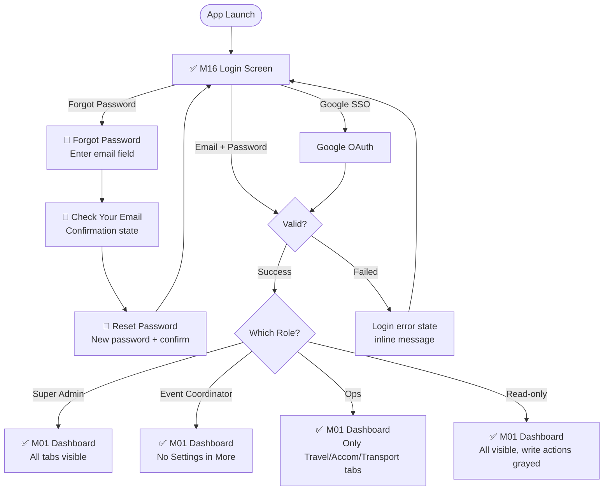
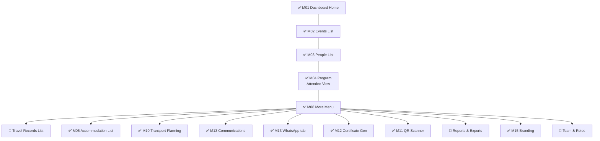
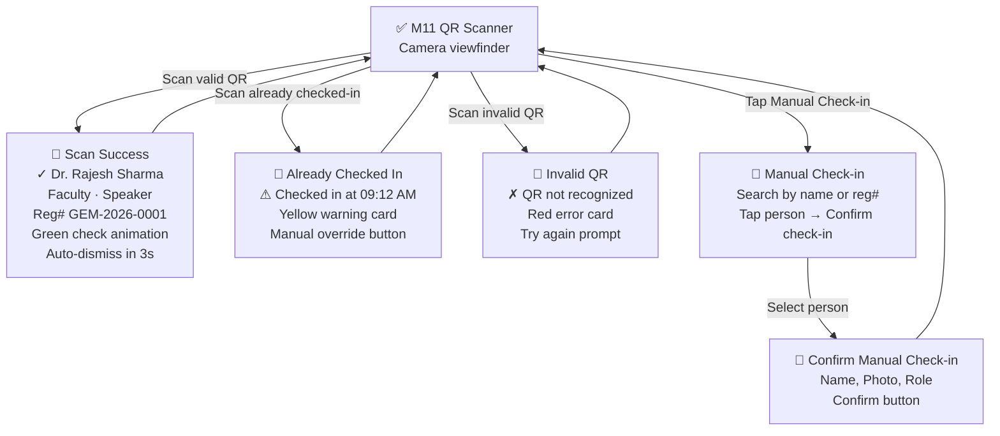
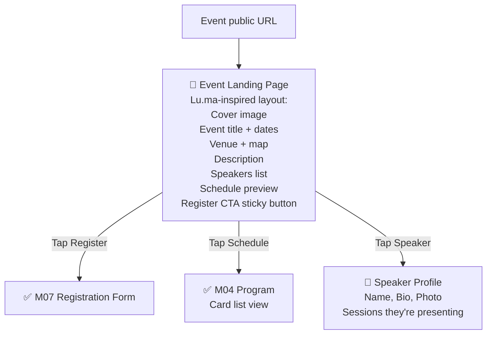

# GEM India — Complete User Flow Map

> Every click path. Every role. Every screen. Every state.
> Screens marked ✅ exist. Screens marked 🔴 are MISSING and must be designed.

---

## Flow 1: Authentication



---

## Flow 2: Main Navigation (Bottom Tab Bar)



---

## Flow 3: Event Lifecycle (Super Admin / Coordinator)

```mermaid
flowchart TD
    EVENTS[✅ M02 Events List] -->|Tap "+ New"| CREATE[✅ M14 Create Event]
    CREATE -->|Fill fields + toggle modules| SAVE_EVENT{Save}
    SAVE_EVENT -->|Success| EVENT_DETAIL[🔴 Event Detail/Edit<br/>Overview + tabs for each module]
    EVENTS -->|Tap event card| EVENT_DETAIL

    EVENT_DETAIL --> ED_SESSIONS[🔴 Session Manager<br/>List of sessions in event]
    EVENT_DETAIL --> ED_REGISTRATIONS[🔴 Registration Admin<br/>7-status tab list]
    EVENT_DETAIL --> ED_PROGRAM[🔴 M04b Admin Schedule Grid]
    EVENT_DETAIL --> ED_TRAVEL[🔴 Travel Records List]
    EVENT_DETAIL --> ED_ACCOM[✅ M05 Accommodation]
    EVENT_DETAIL --> ED_TRANSPORT[✅ M10 Transport Planning]
    EVENT_DETAIL --> ED_CERTS[✅ M12 Certificates]
    EVENT_DETAIL --> ED_COMMS[✅ M13 Communications]
    EVENT_DETAIL --> ED_AGENDA_PDF[🔴 Agenda PDF Preview]

    ED_SESSIONS -->|Tap "+ Add Session"| ADD_SESSION[🔴 Add/Edit Session Form<br/>Name, Time, Duration, Hall,<br/>Topic, Speaker, Chair,<br/>Panelist, Moderator]
    ADD_SESSION -->|Save| ED_SESSIONS
    ED_SESSIONS -->|Tap session| EDIT_SESSION[🔴 Edit Session<br/>Same form, pre-filled]
    EDIT_SESSION -->|Save changes| REVISED_MAIL{Program changed?}
    REVISED_MAIL -->|Yes| SEND_REVISED[🔴 Send Revised Mail<br/>Preview changes → Confirm]
    REVISED_MAIL -->|No| ED_SESSIONS
```

---

## Flow 4: People Management

```mermaid
flowchart TD
    PEOPLE[✅ M03 People List] -->|Tap "+ Add"| ADD_PERSON[🔴 Add Person Form<br/>Name, Designation, Specialty,<br/>City, Mobile, Email, Role tags]
    ADD_PERSON -->|Save| PERSON_DETAIL[✅ M09 Person Detail]

    PEOPLE -->|Tap "Import"| IMPORT_START[🔴 CSV Import Step 1<br/>Upload file area]
    IMPORT_START -->|Upload CSV| IMPORT_MAP[🔴 CSV Import Step 2<br/>Column Mapping<br/>Auto-match + manual dropdowns]
    IMPORT_MAP -->|Next| IMPORT_PREVIEW[🔴 CSV Import Step 3<br/>Preview rows + duplicate handling<br/>Update / Skip / Create New]
    IMPORT_PREVIEW -->|Import| IMPORT_SUCCESS[🔴 Import Success<br/>X imported, Y skipped, Z errors<br/>Download error file link]
    IMPORT_SUCCESS --> PEOPLE

    PEOPLE -->|Tap person card| PERSON_DETAIL
    PERSON_DETAIL -->|Tap Edit| EDIT_PERSON[🔴 Edit Person Form<br/>Pre-filled, same as Add]
    PERSON_DETAIL -->|Tap "Merge"| MERGE[🔴 Merge/Dedup<br/>Side-by-side comparison<br/>Field-by-field selection<br/>Choose primary record]
    MERGE -->|Confirm Merge| PERSON_DETAIL

    PEOPLE -->|Tap filter chip| FILTERED_LIST[✅ M03 with active filter<br/>Delegates / Faculty / Sponsors]
    PEOPLE -->|Search| SEARCH_RESULTS[✅ M03 with search results]
```

---

## Flow 5: Scientific Program (Admin — The Complex One)

```mermaid
flowchart TD
    PROGRAM_ADMIN[🔴 Admin Schedule Grid<br/>Two-panel: Session list + Hall×Time grid<br/>Horizontal scroll on mobile] -->|Drag session to grid| PLACED[Session placed in hall+time]
    PROGRAM_ADMIN -->|Tap placed session| SESSION_DETAIL_POPUP[🔴 Session Detail Popup<br/>Title, Hall, Time, Duration<br/>Assigned faculty with roles]
    SESSION_DETAIL_POPUP -->|Edit| EDIT_SESSION_FORM[🔴 Edit Session Form]
    EDIT_SESSION_FORM -->|Save| PROGRAM_ADMIN

    PROGRAM_ADMIN -->|Tap "Send All Responsibilities"| FACULTY_MAIL_PREVIEW[🔴 Faculty Mail Preview<br/>Per-faculty summary:<br/>Session A — Speaker — Hall A — 10:00<br/>Session B — Chair — Hall B — 14:00]
    FACULTY_MAIL_PREVIEW -->|Confirm Send| MAIL_SENDING[🔴 Sending State<br/>Progress: 42/86 sent]
    MAIL_SENDING --> MAIL_DONE[🔴 Send Complete<br/>86 sent, 0 failed]

    PROGRAM_ADMIN -->|Tap "View as Attendee"| PROGRAM_ATTENDEE[✅ M04 Program<br/>Card list view]

    PROGRAM_ADMIN -->|Conflict detected| CONFLICT_ALERT[🔴 Conflict Alert<br/>Dr. Sharma is in Hall A and Hall B<br/>at 10:00 simultaneously]
```

---

## Flow 6: Registration (Two Paths)

```mermaid
flowchart TD
    subgraph "Path A: Delegate Self-Register (Public)"
        EVENT_LANDING[🔴 Event Landing Page<br/>Public info, speakers, schedule<br/>Register CTA button] -->|Tap Register| REG_FORM[✅ M07 Registration Form]
        REG_FORM -->|Submit| REG_SUCCESS[🔴 Registration Success<br/>✓ You're registered!<br/>Reg# GEM-2026-0001<br/>QR Code displayed<br/>Add to Calendar button<br/>Share on WhatsApp button]
        REG_SUCCESS -->|Email sent| CONF_EMAIL[Confirmation Email<br/>with QR + calendar invite]
        REG_SUCCESS -->|WA sent| CONF_WA[WhatsApp message<br/>with reg details]
    end

    subgraph "Path B: Faculty Invitation (Admin-initiated)"
        ADMIN[Admin/Coordinator] -->|From People or Program| INVITE_FACULTY[🔴 Invite Faculty<br/>Select person → Assign role<br/>Speaker/Chair/Moderator/Panelist<br/>→ Send invitation email]
        INVITE_FACULTY --> INVITE_EMAIL[Invitation email with<br/>Confirm Participation link]
        INVITE_EMAIL -->|Faculty clicks link| CONFIRM_PAGE[🔴 Confirm Participation<br/>Shows: Event, Role, Sessions<br/>Accept / Decline buttons]
        CONFIRM_PAGE -->|Accept| CONFIRMED[🔴 Confirmed State<br/>✓ Participation confirmed<br/>Your sessions listed]
        CONFIRM_PAGE -->|Decline| DECLINED[Decline → Admin notified]
    end
```



---

## Flow 7: Travel Info

```mermaid
flowchart TD
    TRAVEL_LIST[🔴 Travel Records List<br/>All travel records for active event<br/>Search, filter by status] -->|Tap "+ Add"| TRAVEL_FORM[✅ M06 Travel Form<br/>Step 1: Select delegate<br/>Step 2: Fill details<br/>Step 3: Send]
    TRAVEL_FORM -->|Save & Send| TRAVEL_CONFIRM[🔴 Travel Send Confirmation<br/>✓ Itinerary sent to Dr. Sharma<br/>Email ✓ WhatsApp ✓<br/>Attachment: ticket.pdf]
    TRAVEL_CONFIRM --> TRAVEL_LIST

    TRAVEL_LIST -->|Tap record| TRAVEL_DETAIL[🔴 Travel Detail View<br/>All fields displayed<br/>Edit / Resend / Delete actions]
    TRAVEL_DETAIL -->|Edit| TRAVEL_FORM
    TRAVEL_DETAIL -->|Change triggers| CASCADE{Inngest Cascade}
    CASCADE --> FLAG_ACCOM[Red flag on Accommodation]
    CASCADE --> FLAG_TRANSPORT[Recalculate transport batch]
    CASCADE --> NOTIFY_DELEGATE[Send change notification to delegate]
```

---

## Flow 8: Accommodation

```mermaid
flowchart TD
    ACCOM_LIST[✅ M05 Accommodation List<br/>With red/yellow flags] -->|Tap "+ Add"| ACCOM_FORM[🔴 Accommodation Form<br/>Auto-loaded delegate list<br/>Hotel Name, Room No., Address<br/>Check-in/out, Booking PDF<br/>Google Maps link]
    ACCOM_FORM -->|Save| ACCOM_SEND[Auto-send Email + WA<br/>with hotel details + map]
    ACCOM_SEND --> ACCOM_LIST

    ACCOM_LIST -->|Tap flagged record| ACCOM_FLAG_DETAIL[✅ M05 Flag Detail<br/>Shows WHAT changed, WHEN<br/>Mark Reviewed / Resolve buttons]
    ACCOM_FLAG_DETAIL -->|Mark Reviewed| YELLOW_STATE[Yellow flag state]
    ACCOM_FLAG_DETAIL -->|Resolve| CLEARED[Flag cleared]

    ACCOM_LIST -->|Tap "Show flagged only"| FLAGGED_VIEW[✅ M05 Filtered<br/>Only red + yellow flags]

    ACCOM_LIST -->|Tap Export| ROOMING_EXPORT[🔴 Rooming List Export<br/>Select hotel → Preview list<br/>→ Export Excel / Share link]
```

---

## Flow 9: Transport & Arrival Planning

```mermaid
flowchart TD
    TRANSPORT[✅ M10 Arrival Planning<br/>Grouped by time + city] -->|Tap city card| ARRIVAL_DETAIL[🔴 Arrival Batch Detail<br/>10 people from BOM at 08:00<br/>List of names, flight numbers<br/>Vehicle assignment dropdown]

    TRANSPORT -->|Tap "Vehicle Board"| KANBAN[🔴 Vehicle Assignment Board<br/>Kanban: Van-1 / Van-2 / Van-3 / Unassigned<br/>Drag delegate cards between columns<br/>Count per column]

    ARRIVAL_DETAIL -->|Assign to vehicle| KANBAN
    KANBAN -->|Drag card| ASSIGN[Status updates, count refreshes]
```

---

## Flow 10: Certificates

```mermaid
flowchart TD
    CERT_HOME[✅ M12 Certificate Gen<br/>Choose template + recipients] -->|Tap template| CERT_EDITOR[🔴 Certificate Template Editor<br/>pdfme WYSIWYG<br/>Drag: text, logo, QR, background<br/>Insert [recipient.name] etc.<br/>Preview with sample data]
    CERT_EDITOR -->|Save template| CERT_HOME
    CERT_HOME -->|Select recipients + Generate| CERT_PROGRESS[🔴 Generation Progress<br/>Generating 1,247 certificates...<br/>Progress bar]
    CERT_PROGRESS --> CERT_DONE[🔴 Generation Complete<br/>1,247 generated<br/>Send via Email + WA<br/>Download ZIP<br/>View all issued]
    CERT_DONE -->|View issued| CERT_LIST[🔴 Issued Certificates List<br/>Search by name/reg#<br/>Resend / Revoke actions]

    subgraph "Public Self-Serve"
        CERT_VERIFY[🔴 Certificate Verification<br/>Enter Reg# or Scan QR] -->|Valid| CERT_VIEW[🔴 Certificate View<br/>Name, Event, Date, ID<br/>Download PDF button<br/>QR code displayed]
        CERT_VERIFY -->|Invalid| CERT_INVALID[Not found state]
    end
```

---

## Flow 11: Communications

```mermaid
flowchart TD
    COMMS[✅ M13 Communications<br/>Templates + Delivery Log] -->|Tap template card| TEMPLATE_EDITOR[🔴 Template Editor<br/>Subject line field<br/>Body with rich text<br/>Variable picker: {{delegate_name}}<br/>{{event_name}} {{venue}} etc.<br/>Phone preview toggle]
    TEMPLATE_EDITOR -->|Save| COMMS

    COMMS -->|Tap "Send Campaign"| CAMPAIGN_SELECT[🔴 Send Campaign Step 1<br/>Select template]
    CAMPAIGN_SELECT --> CAMPAIGN_RECIPIENTS[🔴 Send Campaign Step 2<br/>Choose: All Delegates / Faculty Only<br/>/ Filtered by role or status<br/>/ Custom selection]
    CAMPAIGN_RECIPIENTS --> CAMPAIGN_PREVIEW[🔴 Send Campaign Step 3<br/>Preview one sample message<br/>Recipient count: 1,247<br/>Channel: Email + WhatsApp]
    CAMPAIGN_PREVIEW -->|Send| CAMPAIGN_SENDING[🔴 Sending Progress<br/>842/1,247 sent...]
    CAMPAIGN_SENDING --> CAMPAIGN_DONE[🔴 Campaign Complete<br/>1,200 delivered, 47 failed<br/>View failed → Retry]

    COMMS -->|Tap delivery log item| LOG_DETAIL[🔴 Message Detail<br/>Recipient, Template, Channel<br/>Status timeline: Sent → Delivered → Read<br/>Retry button if failed]
```

---

## Flow 12: QR Scanner States



---

## Flow 13: Reports & Exports

```mermaid
flowchart TD
    REPORTS[🔴 Reports & Exports] --> REP_AGENDA[Agenda PDF<br/>Download / Email]
    REPORTS --> REP_ROSTER[Faculty Roster<br/>Excel export]
    REPORTS --> REP_TRAVEL[Travel Summary<br/>Excel export]
    REPORTS --> REP_ROOMING[Rooming List<br/>Per-hotel Excel / Share link]
    REPORTS --> REP_TRANSPORT[Transport Plan<br/>Per-date batch summary]
    REPORTS --> REP_ATTENDANCE[Attendance Report<br/>Check-in rates by session]
    REPORTS --> REP_COMMS[Communication Log<br/>Delivery stats: sent/delivered/read/failed]

    REPORTS -->|Tap any report| REPORT_PREVIEW[🔴 Report Preview<br/>Table/chart view<br/>Export button: PDF / Excel / CSV]
    REPORT_PREVIEW -->|Export| DOWNLOAD[Download / Email file]

    REPORTS -->|Tap "Archives"| ARCHIVES[🔴 Per-Event Archive<br/>Past events list<br/>Browse PDFs, comms, exports]
```

---

## Flow 14: Settings & Team (Super Admin Only)

```mermaid
flowchart TD
    SETTINGS[🔴 Team & Roles] --> MEMBERS_LIST[🔴 Members List<br/>Name | Role dropdown | Joined | Actions]
    SETTINGS -->|Tap "Invite"| INVITE[🔴 Invite Member<br/>Email field + Role dropdown<br/>Send Invite button]
    INVITE -->|Send| INVITE_SENT[Invitation email sent<br/>Pending state in members list]

    MEMBERS_LIST -->|Change role dropdown| ROLE_CHANGED[Role updated instantly]
    MEMBERS_LIST -->|Tap Remove| CONFIRM_REMOVE[🔴 Confirm Remove<br/>Are you sure? This will revoke access.]
```

---

## Flow 15: Public Event Landing Page



---

## COMPLETE SCREEN INVENTORY

### Existing (16 screens) ✅
| # | Screen | Flow |
|---|--------|------|
| M01 | Dashboard Home | F2 |
| M02 | Events List | F3 |
| M03 | People List | F4 |
| M04 | Scientific Program (Attendee) | F5 |
| M05 | Accommodation + Flags | F8 |
| M06 | Travel Info Form | F7 |
| M07 | Registration Form | F6 |
| M08 | More Menu | F2 |
| M09 | Person Detail | F4 |
| M10 | Transport Planning | F9 |
| M11 | QR Scanner | F12 |
| M12 | Certificate Generation | F10 |
| M13 | Communications | F11 |
| M14 | Create Event | F3 |
| M15 | Branding | N/A |
| M16 | Login | F1 |

### Missing (need to design) 🔴
| # | Screen | Flow | Complexity |
|---|--------|------|-----------|
| M17 | Forgot Password | F1 | Simple |
| M18 | Reset Password | F1 | Simple |
| M19 | Team & Roles (Members List) | F14 | Medium |
| M20 | Invite Member | F14 | Simple |
| M21 | Event Detail/Edit | F3 | Medium |
| M22 | Session Manager | F3 | Medium |
| M23 | Add/Edit Session Form | F3 | Medium |
| M24 | Agenda PDF Preview | F3 | Simple |
| M25 | Event Landing Page (Public) | F15 | Complex |
| M26 | Faculty Invitation | F6 | Medium |
| M27 | Confirm Participation (Public) | F6 | Simple |
| M28 | Registration Success | F6 | Simple |
| M29 | Registration Admin List | F6 | Medium |
| M30 | Admin Schedule Grid | F5 | **Complex** |
| M31 | Faculty Responsibilities Preview | F5 | Medium |
| M32 | CSV Import Flow (3 steps) | F4 | **Complex** |
| M33 | Merge/Dedup | F4 | Medium |
| M34 | Add Person Form | F4 | Simple |
| M35 | Travel Records List | F7 | Medium |
| M36 | Accommodation Form | F8 | Medium |
| M37 | Rooming List Export | F8 | Simple |
| M38 | Vehicle Assignment Kanban | F9 | Medium |
| M39 | Template Editor | F11 | **Complex** |
| M40 | Send Campaign Flow (3 steps) | F11 | Medium |
| M41 | Certificate Template Editor | F10 | **Complex** |
| M42 | Issued Certificates List | F10 | Medium |
| M43 | Certificate Verification (Public) | F10 | Simple |
| M44 | QR Scan Success State | F12 | Simple |
| M45 | QR Scan Duplicate State | F12 | Simple |
| M46 | QR Manual Check-in Search | F12 | Simple |
| M47 | Reports & Exports | F13 | Medium |
| M48 | Per-Event Archive | F13 | Simple |
| M49 | Audit Log View | F4 | Medium |
| M50 | Speaker Profile (Public) | F15 | Simple |

### Total: 50 screens for complete coverage
- 16 done ✅
- 34 remaining 🔴
- 4 marked **Complex** (need most design attention)
